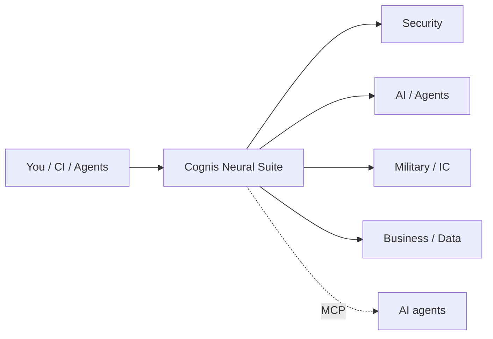

<a name="top"></a>
<div align="center">


# Cognis Neural Suite

### 271+ single-purpose, self-hostable, MCP-native tools — security · AI · military/IC · compliance · data · dev · business

 [](LICENSE)  


</div>

Every tool ships a CLI, JSON/SARIF output, an MCP server, polyglot ports (Py/JS/Go/Rust), a Dev Container, cross-OS + cloud deploy, and CI/CodeQL. Most ship **real, tested implementations**.



## Why this suite stands out

Most tools make you choose: cloud-locked **or** abandoned OSS; one language; one IDE; a black box. The Cognis Neural Suite is the rare combination that's **all of the below, across every tool**:

- 🔒 **Self-hosted & private** — runs on your box, your data never leaves.
- 🧠 **MCP-native** — every tool is an agent capability; drive the whole suite from Claude/Cursor/agents.
- 🌐 **Polyglot** — the same logic in Python, JavaScript, Go, and Rust (`ports/`).
- 🧩 **Unified** — one license, one CLI grammar, one JSON/SARIF shape, so findings compose across tools.
- ✅ **Real, tested code** — not slideware; CLIs you can `pip install` and run today.
- 🚀 **Ships everywhere** — pip/pipx/uv/Docker/Homebrew/curl, Linux/macOS/Windows, devcontainer, k8s, AWS/Azure/GCP.

**No other single org gives you this breadth (security → AI → military/IC → compliance → data → dev) with this much coherence.**

## ⭐ Start here (5 that punch above their weight)

| Try | One-liner |
|---|---|
| [quantumready](https://github.com/cognis-digital/quantumready) | grade your code's post-quantum exposure (NIST FIPS 203/204/205) |
| [agentpassport](https://github.com/cognis-digital/agentpassport) | the unsolved 2026 problem: prove which human authorized which agent |
| [uncensored-fleet](https://github.com/cognis-digital/uncensored-fleet) | one-command local multi-model LLM fleet + agent harness |
| [cognis-code](https://github.com/cognis-digital/cognis-code) | local uncensored coding wired into every IDE |
| [mcpify](https://github.com/cognis-digital/mcpify) | turn ANY CLI into an MCP server in one line |

## Install any tool — many ways, every platform

```bash
pip install "git+https://github.com/cognis-digital/<tool>.git"   # pip (works today)
pipx install "git+https://github.com/cognis-digital/<tool>.git"  # isolated CLI
uv tool install "git+https://github.com/cognis-digital/<tool>.git"
docker run --rm ghcr.io/cognis-digital/<tool>:latest --help       # Docker
curl -fsSL https://raw.githubusercontent.com/cognis-digital/<tool>/main/install.sh | sh
```
Every repo also ships Linux/macOS/Windows setup scripts, a Dev Container, JS/Go/Rust ports, and cloud deploy (Docker/k8s/Terraform/AWS/Azure/GCP). See each repo's `docs/INSTALL.md`.

## Catalog


<details><summary><b>🛡️ AI Security & Agents</b> — 36 repos</summary>

| Tool | Description |
|---|---|
| [adversa](https://github.com/cognis-digital/adversa) | LLM red-team harness — OWASP LLM Top 10 + MITRE ATLAS attack packs |
| [aegis](https://github.com/cognis-digital/aegis) | AI Agent Permission & Access Auditor — surfaces the lethal trifecta of credentials + injection + reach |
| [agentlog](https://github.com/cognis-digital/agentlog) | Agentic workflow replay & audit with OTel GenAI semantic conventions |
| [agentpassport](https://github.com/cognis-digital/agentpassport) | Verifiable AI-agent identity + multi-hop delegation chains anchored to a human principal (the unsolved 2026 agent-auth gap) |
| [agentsmith](https://github.com/cognis-digital/agentsmith) | Config-first scaffolding and orchestration for multi-agent workflows |
| [aicard](https://github.com/cognis-digital/aicard) | Auto-generated NIST AI RMF / EU AI Act Annex IV model & system cards |
| [biascope](https://github.com/cognis-digital/biascope) | Embedded bias probe suite — demographic / occupational / geographic |
| [cloud-setups](https://github.com/cognis-digital/cloud-setups) | Firebase, GCP, and Azure project setups — bootstrap, deploy, IaC, and emulators, merged and rebranded |
| [cognis-devbox](https://github.com/cognis-digital/cognis-devbox) | Custom dev OS image (Packer/KVM/Vagrant/cloud-init) with every language + cloud + AI tool preinstalled |
| [cognis-operations](https://github.com/cognis-digital/cognis-operations) | How an agentic company runs — Cognis Digital's 4-layer operating model, org chart, agent registry, and governance |
| [cognis-sources](https://github.com/cognis-digital/cognis-sources) | Curated index of 10k+ public technical & research links (privacy-filtered) |
| [compliance-atlas](https://github.com/cognis-digital/compliance-atlas) | Condensed, cross-walked reference for SOC2, ISO 27001, NIST CSF/800-53/800-171, CMMC, GDPR, CCPA, HIPAA, PCI DSS, EU AI Act |
| [evalbench](https://github.com/cognis-digital/evalbench) | Offline LLM / agent eval harness with regression gates |
| [guardpost](https://github.com/cognis-digital/guardpost) | Runtime agent firewall — PII redaction, rate limits, policy enforcement |
| [hallumark](https://github.com/cognis-digital/hallumark) | LLM hallucination & grounding auditor for RAG systems |
| [engram](https://github.com/cognis-digital/engram) | Model-agnostic, portable long-term memory framework for AI agents (MCP-native) |
| [ledgermind](https://github.com/cognis-digital/ledgermind) | Local LLM cost & token forensics proxy with anomaly detection |
| [locateanything](https://github.com/cognis-digital/locateanything) | Infer where a photo was taken using a local uncensored vision + reasoning model (OSINT/geoint, 100% local) |
| [mcpharden](https://github.com/cognis-digital/mcpharden) | MCP server hardening linter — capability declarations, transport, tool descriptions |
| [mcpify](https://github.com/cognis-digital/mcpify) | Turn any command-line tool into an MCP server — one line, zero boilerplate |
| [memorybank](https://github.com/cognis-digital/memorybank) | Portable long-term memory store for agents, exposed over MCP |
| [modelroute](https://github.com/cognis-digital/modelroute) | Local model router / proxy across Ollama, vLLM, and cloud with fallback |
| [omni-install](https://github.com/cognis-digital/omni-install) | One menu to install every language, cloud CLI, container, and AI tool — Linux/macOS/Windows |
| [privacyspoof](https://github.com/cognis-digital/privacyspoof) | AdGuard/uBlock blocklists + UA/geo/cookie/session spoofing with a browser compatibility matrix |
| [promptmirror](https://github.com/cognis-digital/promptmirror) | Prompt-injection & indirect-injection scanner for any LLM context input |
| [promptpack](https://github.com/cognis-digital/promptpack) | Versioned prompt / template registry with A/B and rollbacks |
| [ragkit](https://github.com/cognis-digital/ragkit) | Batteries-included local RAG pipeline — ingest, index, serve |
| [ragshield](https://github.com/cognis-digital/ragshield) | RAG corpus poisoning detector — embedding anomalies, backdoor triggers |
| [repo-roast](https://github.com/cognis-digital/repo-roast) | An AI roasts (and then constructively fixes) your repo — local, free, savage |
| [setup-scripts](https://github.com/cognis-digital/setup-scripts) | Curated, idempotent Ubuntu/Debian setup scripts for popular dev & infra tools |
| [skillhub](https://github.com/cognis-digital/skillhub) | Local skill registry and installer for AI agents |
| [skills](https://github.com/cognis-digital/skills) | Agent skill registry — portable skills for AI agents (MCP/Claude/ClawHub style) |
| [templates](https://github.com/cognis-digital/templates) | Starter templates: Python CLI, MCP server, Dockerfile, CI, devcontainer, and more |
| [toolguard](https://github.com/cognis-digital/toolguard) | Runtime allowlist and policy for agent tool-calls |
| [uncensored-fleet](https://github.com/cognis-digital/uncensored-fleet) | Deploy a local multi-model LLM fleet (llama.cpp) with an agent harness, engram memory, and a one-command CLI |
| [windows-toolkit](https://github.com/cognis-digital/windows-toolkit) | Windows power-user starter kit — curated tools, 80+ shortcuts, one-command winget setup |

</details>

<details><summary><b>🪖 Military & IC</b> — 27 repos</summary>

| Tool | Description |
|---|---|
| [adsbwatch](https://github.com/cognis-digital/adsbwatch) | Analyze an ADS-B feed/CSV for anomalies: callsign spoofing, squawk 7500/7600/7700, and unusual loiter patterns. |
| [airgap-pkg](https://github.com/cognis-digital/airgap-pkg) | Self-contained installer for airgapped (SIPR/JWICS-style) environments |
| [basemap](https://github.com/cognis-digital/basemap) | Build and query a structured catalog of installations/AOIs with distance, sector, and coverage queries. |
| [classguard](https://github.com/cognis-digital/classguard) | Validate classification banner markings (CUI/CONFIDENTIAL/SECRET) in documents per portion-marking rules. |
| [classmark](https://github.com/cognis-digital/classmark) | CAPCO-shape classification banner + portion marking library — placeholders only |
| [comint-osquery](https://github.com/cognis-digital/comint-osquery) | DISA STIG-aligned osquery configs + RMF mapper |
| [convoy-or](https://github.com/cognis-digital/convoy-or) | Military convoy routing w/ escort, dwell, threat-cost overlays |
| [convoyplan](https://github.com/cognis-digital/convoyplan) | Defense logistics route/sustainment planner computing fuel, resupply windows, and chokepoint risk from a YAML plan. |
| [ewcorr](https://github.com/cognis-digital/ewcorr) | Correlate electronic-warfare event logs by time/frequency/bearing to cluster emitters. |
| [geoaoi](https://github.com/cognis-digital/geoaoi) | Area-of-interest geospatial helper: bounding boxes, geofence checks, and change-event diffs from coordinate logs. |
| [geoaoi-pro](https://github.com/cognis-digital/geoaoi-pro) | MIL-STD-2525 / APP-6 symbology + AOI helpers (QGIS-compatible) |
| [honeypot-mil](https://github.com/cognis-digital/honeypot-mil) | Honeypot event enrichment + STIX/TAXII + CISA IOC export |
| [itarcheck](https://github.com/cognis-digital/itarcheck) | Flags potential ITAR/EAR export-controlled terms and USML categories in code, datasheets, and docs. |
| [milstdlint](https://github.com/cognis-digital/milstdlint) | Lint documents against MIL-STD / DoD formatting and classification-marking rules. |
| [natosymbol](https://github.com/cognis-digital/natosymbol) | Generate and validate APP-6/MIL-STD-2525 symbol identification codes (SIDC). |
| [opsecscan](https://github.com/cognis-digital/opsecscan) | Scan documents and file metadata for OPSEC leaks: geotags, author, GPS EXIF, unit identifiers. |
| [readiness](https://github.com/cognis-digital/readiness) | Compute unit readiness (C-ratings style) from a personnel/equipment/training YAML and flag gaps. |
| [readiness-rms](https://github.com/cognis-digital/readiness-rms) | Unit-readiness C-rating dashboard (C1-C4) — personnel, equipment, training |
| [redforge-c2](https://github.com/cognis-digital/redforge-c2) | Authorized red-team engagement governance: scope enforcement, TPI, audit-log overlay |
| [rfsurvey](https://github.com/cognis-digital/rfsurvey) | Analyze RF spectrum-occupancy CSV/metadata for band usage, interference, and anomalies. |
| [rmf-package](https://github.com/cognis-digital/rmf-package) | Auto-generate SSP / POAM / SAR (eMASS / Xacta import format) |
| [scifops](https://github.com/cognis-digital/scifops) | SCIF/SAPF compliance helpers: badge audit, TPI, escort tracker |
| [sigmeta](https://github.com/cognis-digital/sigmeta) | Parse and classify signal metadata (freq, modulation, bandwidth) into a normalized catalog. |
| [sigsurvey-rf](https://github.com/cognis-digital/sigsurvey-rf) | RF spectrum survey, NTIA/FCC-aware band-plan validator |
| [stigsentry](https://github.com/cognis-digital/stigsentry) | DISA STIG checker + NIST 800-53 RMF mapper + POAM emitter |
| [threatmodeler](https://github.com/cognis-digital/threatmodeler) | Generate STRIDE threat models and attack trees from a YAML system spec. |
| [uaslog](https://github.com/cognis-digital/uaslog) | Counter-UAS telemetry/log analyzer that flags drone-detection events, RF bands, and track anomalies. |

</details>

<details><summary><b>⚔️ Red Team & Offensive</b> — 5 repos</summary>

| Tool | Description |
|---|---|
| [c2detect](https://github.com/cognis-digital/c2detect) | C2 server fingerprinter — Cobalt Strike, Sliver, Mythic, Havoc, Brute Ratel |
| [crackq](https://github.com/cognis-digital/crackq) | Self-hosted password cracking queue — multi-user hashcat with audit log |
| [payloadlab](https://github.com/cognis-digital/payloadlab) | Static malicious payload analyzer — PE/ELF/LNK/macro/OneNote |
| [pwnreview](https://github.com/cognis-digital/pwnreview) | Pentest report generator — YAML findings to CREST-grade PDF |
| [redpath](https://github.com/cognis-digital/redpath) | Active Directory attack path mapper — minimum-cost paths + remediation priority |

</details>

<details><summary><b>🔵 Blue Team & Detection</b> — 6 repos</summary>

| Tool | Description |
|---|---|
| [canarynet](https://github.com/cognis-digital/canarynet) | Self-hosted canary token network — AWS keys, DNS, docs, web URLs |
| [edrgap](https://github.com/cognis-digital/edrgap) | EDR coverage & bypass detector — reconciles MDM + EDR + AD inventories |
| [honeytrace](https://github.com/cognis-digital/honeytrace) | Active-decoy network lure system — SSH, RDP, SMB, web honeypots |
| [phishforge](https://github.com/cognis-digital/phishforge) | Open-source phishing simulation — campaigns, templates, training |
| [sbomgate](https://github.com/cognis-digital/sbomgate) | Continuous SBOM diff & vulnerability watch with maintainer-change tracking |
| [sentrylog](https://github.com/cognis-digital/sentrylog) | Single-file SIEM for small teams — Sigma rules + multi-source ingest |

</details>

<details><summary><b>🎯 Tactical Security</b> — 30 repos</summary>

| Tool | Description |
|---|---|
| [attackmap](https://github.com/cognis-digital/attackmap) | Map findings to MITRE ATT&CK techniques + coverage heatmap |
| [authmatrix](https://github.com/cognis-digital/authmatrix) | Test an access-control matrix (role x endpoint) for IDOR/authz gaps |
| [cloudkeys](https://github.com/cognis-digital/cloudkeys) | Find leaked cloud keys (AWS/GCP/Azure) + classify blast radius |
| [corsaudit](https://github.com/cognis-digital/corsaudit) | Detect permissive/misconfigured CORS from headers or a config |
| [cspbuilder](https://github.com/cognis-digital/cspbuilder) | Generate and audit a Content-Security-Policy from a page's resources |
| [dirsight](https://github.com/cognis-digital/dirsight) | Analyze web content-discovery output (ffuf/gobuster) into ranked endpoints |
| [dnsrecon](https://github.com/cognis-digital/dnsrecon) | Aggregate DNS recon (records, zone hints, takeover candidates) |
| [emailrecon](https://github.com/cognis-digital/emailrecon) | Aggregate email OSINT (breach hints, MX, SPF/DMARC posture) |
| [exfilwatch](https://github.com/cognis-digital/exfilwatch) | Detect DNS/HTTP exfiltration patterns (entropy, beaconing) in logs |
| [hashid](https://github.com/cognis-digital/hashid) | Identify hash types and estimate crack cost/feasibility |
| [headerscan](https://github.com/cognis-digital/headerscan) | Grade HTTP security headers (CSP/HSTS/XFO) A-F from a response dump |
| [honeyurl](https://github.com/cognis-digital/honeyurl) | Generate canary URLs/tokens + a matcher for trip events |
| [iocextract](https://github.com/cognis-digital/iocextract) | Extract & defang IOCs (IPs/domains/hashes/URLs) from any text |
| [jwtinspect](https://github.com/cognis-digital/jwtinspect) | Decode JWTs and lint for alg=none, weak secrets, and missing claims |
| [logsift](https://github.com/cognis-digital/logsift) | Detect brute-force, spray, and anomalous auth events in logs |
| [metascrub](https://github.com/cognis-digital/metascrub) | Strip identifying metadata from docs/images before release |
| [nmapdiff](https://github.com/cognis-digital/nmapdiff) | Diff two scans to surface new hosts/ports/services |
| [pcapsummary](https://github.com/cognis-digital/pcapsummary) | Summarize flows/talkers/protocols from a pcap text export |
| [phishcheck](https://github.com/cognis-digital/phishcheck) | Score URLs/emails for phishing signals (lookalike, auth, intent) |
| [portfan](https://github.com/cognis-digital/portfan) | Summarize and diff nmap XML into prioritized, attackable findings |
| [ratecheck](https://github.com/cognis-digital/ratecheck) | Probe API rate-limit/abuse resistance from a request spec |
| [reposecure](https://github.com/cognis-digital/reposecure) | One-shot repo security posture grade (secrets/CI/branch rules/deps) |
| [s3sniff](https://github.com/cognis-digital/s3sniff) | Flag risky cloud-bucket ACLs/policies from a listing or policy JSON |
| [sigmacheck](https://github.com/cognis-digital/sigmacheck) | Lint and unit-test Sigma detection rules against sample events |
| [ssltriage](https://github.com/cognis-digital/ssltriage) | Grade TLS config (protocols/ciphers/expiry) from openssl/sslyze output |
| [ssrfind](https://github.com/cognis-digital/ssrfind) | Find SSRF-prone sinks and unvalidated URL fetches in code |
| [subhunt](https://github.com/cognis-digital/subhunt) | Aggregate & dedupe subdomain enumeration from multiple sources |
| [tokenrotate](https://github.com/cognis-digital/tokenrotate) | Plan + track secret rotation across providers from an inventory |
| [webrecon](https://github.com/cognis-digital/webrecon) | Fingerprint web tech/CMS/frameworks from headers + body |
| [yararun](https://github.com/cognis-digital/yararun) | Run simple YARA-style string/regex rules over a directory |

</details>

<details><summary><b>🧪 SecOps & DFIR</b> — 29 repos</summary>

| Tool | Description |
|---|---|
| [apiseclint](https://github.com/cognis-digital/apiseclint) | Lint OpenAPI specs for security gaps (authz, rate-limit, data exposure) |
| [asnmap](https://github.com/cognis-digital/asnmap) | Map ASN/CIDR ownership & neighbors from whois/RIR exports |
| [browserforensics](https://github.com/cognis-digital/browserforensics) | Analyze exported browser history/downloads for IOCs and exfil signs |
| [certsearch](https://github.com/cognis-digital/certsearch) | Analyze Certificate-Transparency exports for subdomains & rogue issuance |
| [cipherdetect](https://github.com/cognis-digital/cipherdetect) | Detect & crack classical ciphers (caesar/vigenere/xor) by scoring |
| [cookieaudit](https://github.com/cognis-digital/cookieaudit) | Audit Set-Cookie flags (Secure/HttpOnly/SameSite) from a response dump |
| [cspm](https://github.com/cognis-digital/cspm) | Cloud security posture from a config export (public buckets, open SGs, weak IAM) |
| [cyberbench](https://github.com/cognis-digital/cyberbench) | Chainable encode/decode/transform pipeline (base64/hex/rot/xor/url/gzip) |
| [dmarcaudit](https://github.com/cognis-digital/dmarcaudit) | SecOps tool — Cognis Neural Suite |
| [dockeraudit](https://github.com/cognis-digital/dockeraudit) | Audit Dockerfiles + image configs for security smells |
| [entropyscan](https://github.com/cognis-digital/entropyscan) | SecOps tool — Cognis Neural Suite |
| [evtxsift](https://github.com/cognis-digital/evtxsift) | Find brute-force, persistence & lateral-movement signals in exported Windows event logs |
| [filecarve](https://github.com/cognis-digital/filecarve) | SecOps tool — Cognis Neural Suite |
| [ghaudit](https://github.com/cognis-digital/ghaudit) | Audit a GitHub org's security posture (branch rules, 2FA, secrets) from an export |
| [githubrecon](https://github.com/cognis-digital/githubrecon) | Map a GitHub user/org footprint & leaked-secret surface from API exports |
| [graphqlmap](https://github.com/cognis-digital/graphqlmap) | Analyze GraphQL introspection for risky fields, depth, and authz gaps |
| [iamlint](https://github.com/cognis-digital/iamlint) | Lint cloud IAM policies (AWS/GCP/Azure JSON) for least-privilege violations |
| [iocrep](https://github.com/cognis-digital/iocrep) | Score IOCs against offline reputation/allow lists with explainable verdicts |
| [k8saudit](https://github.com/cognis-digital/k8saudit) | Audit Kubernetes manifests against CIS-style security rules |
| [memtriage](https://github.com/cognis-digital/memtriage) | Triage memory-dump artifacts: strings, IOCs, suspicious processes from a dump export |
| [mftparse](https://github.com/cognis-digital/mftparse) | Analyze an NTFS $MFT CSV for timestomping and suspicious file activity |
| [prefetchparse](https://github.com/cognis-digital/prefetchparse) | Surface program-execution evidence from Windows Prefetch exports |
| [regexlab](https://github.com/cognis-digital/regexlab) | Test, explain & benchmark regexes + a library of security patterns |
| [stixgen](https://github.com/cognis-digital/stixgen) | Build STIX 2.1 bundles from a list of IOCs/observables |
| [tfscan](https://github.com/cognis-digital/tfscan) | Scan Terraform plans/configs for misconfigurations |
| [timeliner](https://github.com/cognis-digital/timeliner) | Build a forensic super-timeline by merging & normalizing log/artifact CSVs |
| [ttphunt](https://github.com/cognis-digital/ttphunt) | Hunt MITRE ATT&CK techniques across logs with a rule pack |
| [waybackrecon](https://github.com/cognis-digital/waybackrecon) | Mine archived URLs/params/endpoints from a Wayback/CDX export |
| [yaragen](https://github.com/cognis-digital/yaragen) | Generate candidate YARA rules from sample files/strings |

</details>

<details><summary><b>🏦 Fintech & Compliance</b> — 25 repos</summary>

| Tool | Description |
|---|---|
| [accessreview](https://github.com/cognis-digital/accessreview) | Periodic user-access-review (UAR) campaign runner |
| [auditrail](https://github.com/cognis-digital/auditrail) | Tamper-evident audit-log aggregator with hash-chained attestation |
| [chargeguard](https://github.com/cognis-digital/chargeguard) | Monitors dispute/chargeback feeds, flags fraud-rate threshold breaches (VAMP/Visa), and drafts representment evidence packets. |
| [checkpoint-ai](https://github.com/cognis-digital/checkpoint-ai) | NIST AI RMF / EU AI Act / ISO 42001 self-assessment & SSP generator |
| [clearancepath](https://github.com/cognis-digital/clearancepath) | Personnel clearance hygiene tracker — SF-86, SEAD-3/4, training currency |
| [cmmcmap](https://github.com/cognis-digital/cmmcmap) | CMMC Level 2 practice mapper — stack-aware SSP skeleton generator |
| [dpiaforge](https://github.com/cognis-digital/dpiaforge) | DPIA and EU AI Act impact-assessment generator |
| [fedramplens](https://github.com/cognis-digital/fedramplens) | FedRAMP boundary visualizer & OSCAL-format SSP/POAM generator |
| [frameworkmap](https://github.com/cognis-digital/frameworkmap) | Crosswalk controls across NIST, ISO 27001, SOC 2, CMMC, PCI |
| [fraudlens](https://github.com/cognis-digital/fraudlens) | Replays a stream of transactions against pluggable fraud rules and ML scorers, emitting precision/recall and alert volume from the terminal. |
| [gdprkit](https://github.com/cognis-digital/gdprkit) | GDPR/CCPA DSAR, RoPA, and cookie-consent toolkit |
| [gsafinder](https://github.com/cognis-digital/gsafinder) | GSA Schedule opportunity surveyor — SAM.gov + eBuy + FedConnect |
| [iso20022](https://github.com/cognis-digital/iso20022) | Validates, lints, and diffs ISO 20022 / pacs / camt payment messages and translates legacy MT into MX with schema-aware errors. |
| [ledgerproof](https://github.com/cognis-digital/ledgerproof) | Verifies double-entry ledger integrity and tamper-evidence by checking balance invariants and hash-chained journal entries. |
| [obscan](https://github.com/cognis-digital/obscan) | Conformance and security linter for Open Banking / FAPI APIs: validates OAuth flows, consent scopes, and PSD2 endpoints against the spec. |
| [panhound](https://github.com/cognis-digital/panhound) | Scans code, logs, fixtures, and S3 buckets for leaked PANs (Luhn-validated card numbers) and CVVs before they hit prod. |
| [policyforge](https://github.com/cognis-digital/policyforge) | Auto-generate security policies from a short questionnaire |
| [quantumready](https://github.com/cognis-digital/quantumready) | Post-quantum migration readiness scanner — find quantum-vulnerable crypto and map to NIST PQC (FIPS 203/204/205) |
| [sanctscan](https://github.com/cognis-digital/sanctscan) | Screens counterparties and transactions against OFAC/EU/UN sanctions lists with fuzzy name matching and explainable hit scoring. |
| [sbirscout](https://github.com/cognis-digital/sbirscout) | SBIR/STTR topic discovery — DSIP + SBIR.gov + NIH digest with bid scoring |
| [soc2box](https://github.com/cognis-digital/soc2box) | SOC 2 evidence collector and control tracker, self-hosted |
| [tokenvault](https://github.com/cognis-digital/tokenvault) | Self-hostable PCI tokenization microservice and CLI that swaps PANs for format-preserving tokens and proves no raw card data persists. |
| [txgraph](https://github.com/cognis-digital/txgraph) | Builds a transaction graph from ledger/account data and surfaces structuring, layering, and mule-network patterns for AML triage. |
| [vendorvet](https://github.com/cognis-digital/vendorvet) | Third-party / vendor risk questionnaires with SBOM cross-ref |
| [webhookvty](https://github.com/cognis-digital/webhookvty) | Verifies and replays signed payment webhooks (Stripe/Adyen/PayPal/Plaid) locally, catching signature, idempotency, and replay-attack bugs. |

</details>

<details><summary><b>🏥 Healthcare</b> — 10 repos</summary>

| Tool | Description |
|---|---|
| [baadiff](https://github.com/cognis-digital/baadiff) | Scan a repo or infra manifest for HIPAA Security Rule gaps and produce a Business Associate readiness scorecard. |
| [codemap](https://github.com/cognis-digital/codemap) | Translate and validate medical codes across ICD-10, SNOMED CT, LOINC, RxNorm, and CPT from the CLI. |
| [consentledger](https://github.com/cognis-digital/consentledger) | Maintain a tamper-evident, hash-chained audit log of patient-data access and consent events. |
| [deidproof](https://github.com/cognis-digital/deidproof) | Re-identification risk assessment that computes k-anonymity, l-diversity, and HIPAA Safe Harbor compliance on a dataset. |
| [dicomsweep](https://github.com/cognis-digital/dicomsweep) | De-identify DICOM imaging studies per the DICOM PS3.15 Annex E profile, scrubbing tags and burned-in pixel text. |
| [fhirlint](https://github.com/cognis-digital/fhirlint) | Validate FHIR R4/R5 resources and bundles against profiles (US Core, etc.) with precise, line-level error reporting. |
| [hl7tap](https://github.com/cognis-digital/hl7tap) | Parse, pretty-print, diff, and replay HL7 v2 messages over MLLP from the terminal. |
| [phiscrub](https://github.com/cognis-digital/phiscrub) | Stream-scan logs, CSVs, and free-text notes for PHI (names, MRNs, SSNs, dates, addresses) and redact or tokenize in place. |
| [synthcohort](https://github.com/cognis-digital/synthcohort) | Generate statistically realistic synthetic patient cohorts (FHIR/CSV) from a schema spec for dev and testing. |
| [trialwatch](https://github.com/cognis-digital/trialwatch) | Query, diff, and monitor ClinicalTrials.gov records, alerting on status, enrollment, or result changes. |

</details>

<details><summary><b>⛓️ Web3 & Blockchain</b> — 10 repos</summary>

| Tool | Description |
|---|---|
| [approvewarden](https://github.com/cognis-digital/approvewarden) | Scans any wallet for dangerous ERC-20/721/1155 token approvals and infinite allowances, scoring drainer exposure and emitting revoke transactions. |
| [bytematch](https://github.com/cognis-digital/bytematch) | Verifies that deployed on-chain bytecode matches a given source/Foundry build, detecting unverified or tampered proxies and implementations. |
| [forkfuzz](https://github.com/cognis-digital/forkfuzz) | Mainnet-fork invariant fuzzer that replays your contract against live state and stateful sequences to break protocol invariants before deploy. |
| [gasprofiler](https://github.com/cognis-digital/gasprofiler) | Per-opcode and per-function gas profiler that flags unbounded loops, DoS-prone patterns, and regressions against a committed baseline. |
| [mevscope](https://github.com/cognis-digital/mevscope) | Replays a tx or address history to attribute sandwich, frontrun, and backrun MEV extraction with per-trade loss accounting. |
| [oraclewatch](https://github.com/cognis-digital/oraclewatch) | Monitors price-oracle feeds for staleness, deviation, and manipulation exposure, simulating TWAP/spot attack profitability per pool. |
| [reentryx](https://github.com/cognis-digital/reentryx) | Static + symbolic detector that flags reentrancy, cross-function, and read-only reentrancy paths in Solidity/Vyper with CI-gating SARIF output. |
| [rugradar](https://github.com/cognis-digital/rugradar) | Token contract risk scanner detecting honeypots, hidden mint/blacklist functions, owner backdoors, and unlocked liquidity before you ape. |
| [sigsleuth](https://github.com/cognis-digital/sigsleuth) | Decodes raw calldata and EIP-712 typed-data into human-readable intent, flagging blind-signing and malicious permit/Permit2 payloads. |
| [storagelens](https://github.com/cognis-digital/storagelens) | Diffs and decodes contract storage layouts across proxy upgrades to catch storage-collision and uninitialized-slot bugs. |

</details>

<details><summary><b>📡 IoT / OT / Embedded</b> — 10 repos</summary>

| Tool | Description |
|---|---|
| [blescope](https://github.com/cognis-digital/blescope) | Sniff and decode BLE GATT traffic, fingerprint device profiles, and assert on insecure pairing/characteristics in CI against a capture. |
| [canzap](https://github.com/cognis-digital/canzap) | Replay, fuzz, and assert on CAN bus traffic from a .pcap or SocketCAN interface with a tiny YAML DSL. |
| [fwxray](https://github.com/cognis-digital/fwxray) | Diff two firmware images and surface exactly what changed: new binaries, flipped config flags, added certs, and shifted entropy regions. |
| [keyhunt](https://github.com/cognis-digital/keyhunt) | Scan firmware blobs and filesystem dumps for hardcoded private keys, API tokens, default creds, and weak RSA/ECC material. |
| [modpot](https://github.com/cognis-digital/modpot) | Spin up a high-interaction Modbus/DNP3 ICS honeypot that logs attacker register reads/writes as structured JSON. |
| [mqttspy](https://github.com/cognis-digital/mqttspy) | Passively map an MQTT broker: enumerate topics, detect unauthenticated writes, spot PII/secrets in payloads, and emit a risk report. |
| [otaverify](https://github.com/cognis-digital/otaverify) | Validate OTA update packages end-to-end: signature chains, rollback protection, anti-downgrade counters, and delta-patch integrity. |
| [rtosmap](https://github.com/cognis-digital/rtosmap) | Statically map task structures, stack usage, and ISR call graphs in FreeRTOS/Zephyr firmware to flag stack overflows and priority-inversion risks. |
| [sbomb](https://github.com/cognis-digital/sbomb) | Generate a CycloneDX SBOM directly from an unpacked firmware root filesystem and flag components with known CVEs and EOL kernels. |
| [uefiscan](https://github.com/cognis-digital/uefiscan) | Audit UEFI firmware dumps for missing Secure Boot keys, unsigned modules, S3 boot-script vulns, and known SMM threats. |

</details>

<details><summary><b>📱 AppSec & Mobile</b> — 10 repos</summary>

| Tool | Description |
|---|---|
| [apkpeek](https://github.com/cognis-digital/apkpeek) | One-command static triage of Android APK/AAB binaries: surfaces hardcoded secrets, exported components, dangerous permissions, and insecure manifest flags as a single SARIF report. |
| [binhunt](https://github.com/cognis-digital/binhunt) | Game/desktop binary integrity scanner that fingerprints executables, detects common packers/obfuscators, and diffs against a known-good baseline to catch tampering. |
| [cheatsense](https://github.com/cognis-digital/cheatsense) | Anti-cheat telemetry analyzer that ingests game session logs and flags statistically anomalous input/aim/movement signatures with explainable per-flag scoring. |
| [dastlite](https://github.com/cognis-digital/dastlite) | A headless, config-as-code DAST runner that crawls an authenticated web/mobile-API surface and fires a curated active-scan ruleset, emitting deduplicated SARIF. |
| [deeplinkfuzz](https://github.com/cognis-digital/deeplinkfuzz) | Fuzzes Android/iOS deep links, intents, and custom URL schemes against an emulator/device to surface unvalidated-redirect, injection, and component-hijack bugs. |
| [hookcraft](https://github.com/cognis-digital/hookcraft) | Generates ready-to-run Frida instrumentation scripts from a YAML intent (e.g. 'bypass SSL pinning', 'dump crypto keys') and verifies they attach to a target process. |
| [ipasnitch](https://github.com/cognis-digital/ipasnitch) | Static scanner for iOS .ipa bundles that flags ATS exceptions, missing entitlements hardening, embedded URLs/secrets, and weak Info.plist transport settings. |
| [pincheck](https://github.com/cognis-digital/pincheck) | Validates that a mobile app's TLS pinning, certificate transparency, and network-security-config are actually enforced by replaying a MITM handshake against the built artifact. |
| [sbomx](https://github.com/cognis-digital/sbomx) | Generates a CycloneDX SBOM for mobile apps by unpacking native libs and bundled SDKs, then matches components against known-vuln and tracker/privacy databases. |
| [semsift](https://github.com/cognis-digital/semsift) | Lightweight semantic-aware SAST that runs curated taint rules over diffs only, so PRs get fast incremental SAST instead of whole-repo scan fatigue. |

</details>

<details><summary><b>🔍 OSINT & Intelligence</b> — 6 repos</summary>

| Tool | Description |
|---|---|
| [corpmap](https://github.com/cognis-digital/corpmap) | Corporate structure & beneficial-ownership mapper |
| [cryptotrace](https://github.com/cognis-digital/cryptotrace) | Free-tier blockchain investigator — ETH/BTC clustering + sanctions xref |
| [darkmirror](https://github.com/cognis-digital/darkmirror) | Surface-web mirror of public Tor leak-site index for brand monitoring |
| [geolens](https://github.com/cognis-digital/geolens) | Image geolocation toolkit — EXIF, sun-shadow, OCR, reverse-search |
| [maritimeint](https://github.com/cognis-digital/maritimeint) | AIS vessel tracking & sanctions-evasion anomaly detection |
| [personagraph](https://github.com/cognis-digital/personagraph) | Identity resolution dossier — username/email/phone cross-platform |

</details>

<details><summary><b>🗄️ Data & Datasets</b> — 8 repos</summary>

| Tool | Description |
|---|---|
| [csvlens](https://github.com/cognis-digital/csvlens) | Fast CLI for profiling and cleaning huge CSV / Parquet files |
| [datasetcard](https://github.com/cognis-digital/datasetcard) | Auto Dataset Cards / datasheets with Croissant + provenance |
| [duckprobe](https://github.com/cognis-digital/duckprobe) | Zero-setup data-quality checks on any file or warehouse via DuckDB |
| [embedaudit](https://github.com/cognis-digital/embedaudit) | Embedding / vector-store drift and poisoning audit |
| [lineagemap](https://github.com/cognis-digital/lineagemap) | Column-level lineage extracted from SQL and dbt |
| [piiscan](https://github.com/cognis-digital/piiscan) | PII discovery across warehouses and lakes (data-side scanner) |
| [schemadrift](https://github.com/cognis-digital/schemadrift) | Schema-change detector and data-contract tests |
| [seedforge](https://github.com/cognis-digital/seedforge) | Synthetic test-data generator with referential integrity |

</details>

<details><summary><b>🧰 Developer & Supply Chain</b> — 20 repos</summary>

| Tool | Description |
|---|---|
| [alertmux](https://github.com/cognis-digital/alertmux) | Alert dedup, correlation, and routing in front of Grafana / PagerDuty |
| [apidiff](https://github.com/cognis-digital/apidiff) | Breaking-change detector for OpenAPI / GraphQL across commits |
| [cloudbill](https://github.com/cognis-digital/cloudbill) | Multi-cloud cost report, anomaly detection, and FOCUS export |
| [codeglance](https://github.com/cognis-digital/codeglance) | Repo onboarding map — architecture + hotspots for humans and agents |
| [depgraph](https://github.com/cognis-digital/depgraph) | Dependency risk visualizer — Scorecard + OSV + typosquat + maintainer signals |
| [envdoctor](https://github.com/cognis-digital/envdoctor) | .env validator, secret-presence and config-drift checker |
| [flakefinder](https://github.com/cognis-digital/flakefinder) | Flaky-test detector from CI history with quarantine suggestions |
| [gitstory](https://github.com/cognis-digital/gitstory) | Changelog and release notes from conventional commits |
| [k8scost](https://github.com/cognis-digital/k8scost) | Kubernetes cost and rightsizing advisor with no Prometheus dependency |
| [licenselens](https://github.com/cognis-digital/licenselens) | Dependency license + SBOM gate, developer-CLI first |
| [mcpforge](https://github.com/cognis-digital/mcpforge) | Scaffold, test, and publish MCP servers in minutes |
| [ossaudit](https://github.com/cognis-digital/ossaudit) | OSS license compliance auditor — AGPL contamination + NOTICE generation |
| [otelbox](https://github.com/cognis-digital/otelbox) | One-command OpenTelemetry collector + dashboards bundle |
| [pipewatch-pro](https://github.com/cognis-digital/pipewatch-pro) | CI/CD supply-chain auditor — GH Actions / GitLab CI / OWASP CI/CD Top 10 |
| [probesite](https://github.com/cognis-digital/probesite) | Synthetic uptime and Playwright checks exported to Prometheus |
| [promptlint](https://github.com/cognis-digital/promptlint) | Lint, version, and test prompts as code with a CI gate |
| [secretsweep](https://github.com/cognis-digital/secretsweep) | Repo secret scanner + auto-rotator across providers |
| [shipcheck](https://github.com/cognis-digital/shipcheck) | Dockerfile linter with image-size and CVE advisories |
| [statuskit](https://github.com/cognis-digital/statuskit) | Self-hosted status page with incident timeline and subscribers |
| [tokenmeter](https://github.com/cognis-digital/tokenmeter) | Token and cost counter / budgeter for LLM apps, CI-ready |

</details>

<details><summary><b>💼 Business & Ops</b> — 10 repos</summary>

| Tool | Description |
|---|---|
| [boardroom](https://github.com/cognis-digital/boardroom) | Investor-update and KPI one-pager generator from your metrics |
| [churnlens](https://github.com/cognis-digital/churnlens) | Self-hosted SaaS metrics — MRR, churn, LTV from Stripe or CSV |
| [invoctl](https://github.com/cognis-digital/invoctl) | CLI invoicing + payment-link generator with PDF and a local ledger |
| [leadforge](https://github.com/cognis-digital/leadforge) | Lightweight MCP-native CRM pipeline with email sequences |
| [meetingcost](https://github.com/cognis-digital/meetingcost) | Compute the dollar cost of meetings from your calendar (.ics) |
| [orgchart](https://github.com/cognis-digital/orgchart) | Org charts and headcount plans generated from CSV / HRIS export |
| [paywatch](https://github.com/cognis-digital/paywatch) | Recurring-charge and subscription detector from bank/Plaid CSV |
| [quotecraft](https://github.com/cognis-digital/quotecraft) | Proposal / quote / SOW generator — YAML to branded PDF |
| [runbookgen](https://github.com/cognis-digital/runbookgen) | Incident runbook and SOP generator from templates |
| [seataudit](https://github.com/cognis-digital/seataudit) | SaaS license, seat-usage and shadow-IT auditor |

</details>

<details><summary><b>📰 Info Integrity & Privacy</b> — 11 repos</summary>

| Tool | Description |
|---|---|
| [breachwatch](https://github.com/cognis-digital/breachwatch) | Personal breach aggregator — HIBP + DeHashed + stealer-log triage |
| [claimtrace](https://github.com/cognis-digital/claimtrace) | Misinformation provenance tracer — earliest-known appearance graph |
| [deepcheck](https://github.com/cognis-digital/deepcheck) | Lightweight synthetic-media detector with C2PA validation |
| [electionlens](https://github.com/cognis-digital/electionlens) | Influence-operations pattern monitor for election periods |
| [narrativediff](https://github.com/cognis-digital/narrativediff) | News bias & framing diff across 50+ outlets per event |
| [optout](https://github.com/cognis-digital/optout) | Automated data-broker opt-out engine — top 50 brokers, CCPA/GDPR letters |
| [piicomb](https://github.com/cognis-digital/piicomb) | Local PII discovery in your own files — SSN/CC/passport/DL/email/phone/DOB |
| [privacyshell](https://github.com/cognis-digital/privacyshell) | Hardened browser profile generator — Firefox / LibreWolf / Brave |
| [recall](https://github.com/cognis-digital/recall) | Privacy-first local RAG over personal data — encrypted, audit-logged |
| [trackblock](https://github.com/cognis-digital/trackblock) | Family phone stalkerware audit — MVT-class iOS/Android forensics |
| [vaultmap](https://github.com/cognis-digital/vaultmap) | Personal asset & account inventory — estate-planning-grade encrypted |

</details>

<details><summary><b>🤖 AI Infra & Resources</b> — 1 repos</summary>

| Tool | Description |
|---|---|
| [cognis-code](https://github.com/cognis-digital/cognis-code) | Local uncensored AI coding suite — one endpoint wired into VS Code, JetBrains, Cursor, Zed, Neovim, opencode, and Aider |

</details>

<details><summary><b>🎮 Labs & Games</b> — 3 repos</summary>

| Tool | Description |
|---|---|
| [f22-raptor-sim](https://github.com/cognis-digital/f22-raptor-sim) | F-22 Raptor Combat Simulator — Operation Eastern Shield. |
| [fpv-strike-drone](https://github.com/cognis-digital/fpv-strike-drone) | FPV Strike Drone — first-person drone flight & strike sim. |
| [operation-blackout](https://github.com/cognis-digital/operation-blackout) | Operation Blackout — a fast browser FPS. |

</details>

<details><summary><b>More</b> — 14 repos</summary>

| Repo | Description |
|---|---|
| [certpatrol](https://github.com/cognis-digital/certpatrol) | TLS cert lifecycle & rogue-issuance watch via Certificate Transparency |
| [coldforge](https://github.com/cognis-digital/coldforge) | Render personalized cold-outreach sequences from Markdown templates + a contacts CSV, with spam-score linting and per-send dry-run preview. |
| [crmsync](https://github.com/cognis-digital/crmsync) | Bidirectional, idempotent sync of contacts/deals between a local SQLite source-of-truth and CRM APIs (HubSpot/Pipedrive/Salesforce) via one config. |
| [dealflow](https://github.com/cognis-digital/dealflow) | Model your sales pipeline as a YAML state machine and compute conversion rates, stage velocity, and weighted forecast straight from CRM exports. |
| [dnsaudit](https://github.com/cognis-digital/dnsaudit) | DNS posture & misconfiguration scanner — SPF/DKIM/DMARC/DNSSEC/CAA |
| [dripcheck](https://github.com/cognis-digital/dripcheck) | Lint email sequences and drip campaigns for deliverability: SPF/DKIM/DMARC, link health, unsubscribe presence, and CAN-SPAM/GDPR compliance. |
| [egresswatch](https://github.com/cognis-digital/egresswatch) | Server-side outbound connection auditor — eBPF/Falco wrapper |
| [enrichr](https://github.com/cognis-digital/enrichr) | Enrich a leads CSV with firmographics, tech stack, and contact validation from pluggable providers, caching results to avoid duplicate API spend. |
| [introbot](https://github.com/cognis-digital/introbot) | Find warm-intro paths through your team's combined network graph and draft double-opt-in intro requests from a single contacts manifest. |
| [magicid](https://github.com/cognis-digital/magicid) | Identify true file types by magic bytes (beats extensions) |
| [pactgen](https://github.com/cognis-digital/pactgen) | Generate branded sales proposals and SOWs from a YAML scope file + pricing table into PDF/HTML, with a deterministic line-item math check. |
| [partnermap](https://github.com/cognis-digital/partnermap) | Track partnership/channel agreements as YAML records and compute account overlap, co-sell coverage gaps, and renewal/expiry alerts. |
| [raisedeck](https://github.com/cognis-digital/raisedeck) | Build and maintain an investor-update + data-room manifest from a metrics YAML, rendering monthly MRR/burn/runway updates with consistent KPIs. |
| [warmline](https://github.com/cognis-digital/warmline) | Score and rank inbound/outbound leads from a YAML rulebook, emitting a ranked queue as JSON/CSV for your SDRs and CI gates. |

</details>

## ⭐ Star the ones you use

It genuinely helps others find them. Contributions welcome under the collaboration-pull model — see any repo's `CONTRIBUTING.md`.

<a name="verification"></a>
## Verification


Every push is verified end-to-end. Latest audit (2026-06-13):

```text
tests        : 0 passed, 0 failed, 0 errored
compile      : all modules parse
cli          : n/a
package      : n/a
```

<details><summary>CLI surface (<code>--help</code>)</summary>

```text
(see --help)
```
</details>

Full machine-readable results: [`AUDIT.md`](AUDIT.md) · regenerate with `python -m cognis-neural-suite --help` + `pytest -q`.

<div align="right"><a href="#top">↑ back to top</a></div>


## License

Source-available under the **Cognis Open Collaboration License (COCL) v1.0** (some military repos retain their upstream GPL). See each repo's LICENSE.

---
*[Cognis Digital](https://cognis.digital) — Making Tomorrow Better Today.*
