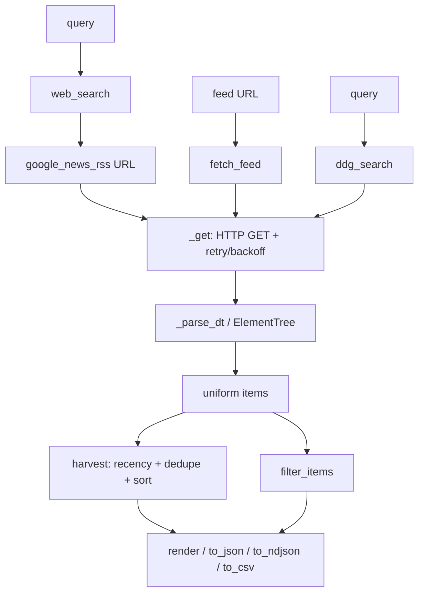

# Architecture — `livesearch`

`livesearch` is a single, self-contained module ([`livesearch.py`](../livesearch.py))
with **zero runtime dependencies** — only the Python standard library
(`urllib`, `xml.etree`, `email.utils`, `csv`, `json`, `re`). It is designed to be
vendored into any monitoring/OSINT tool that needs a *live* source of current items.

## Design goals

- **Keyless & real-time.** No API keys, no accounts. Every result is fetched at call
  time from public endpoints, so data is always as current as the web.
- **Uniform item shape.** Every producer emits the same 5-field dict (`FIELDS`), so
  downstream code and other suite tools compose without adapters.
- **Fail soft.** Feed producers swallow network/parse errors and return `[]` rather
  than raising, so a single dead feed never breaks a harvest.
- **Composable output.** Any item list renders to `plain` / `json` / `ndjson` / `csv`
  and can be filtered by regex or source.

## Data flow

## Layers

| Layer | Functions | Responsibility |
|---|---|---|
| Transport | `_get` | Single HTTP GET with a bounded exponential-backoff retry; re-raises on final failure. |
| Backends | `google_news_rss`, `web_search`, `fetch_feed`, `ddg_search` | Turn a query or URL into a list of uniform items. |
| Parsing | `_parse_dt`, `_tag` | Normalize RFC-822 / ISO-8601 dates to UTC ISO strings; strip XML namespaces. |
| Aggregation | `harvest`, `dedupe`, `filter_items`, `load_sources` | Combine, prune, and de-duplicate across many sources. |
| Presentation | `render`, `to_json`, `to_ndjson`, `to_csv` | Serialize item lists for humans or downstream tools. |
| CLI | `_cli`, `_entry` | Argument parsing and dispatch; `_entry` is the `pip` console-script hook. |

## Error handling contract

- `fetch_feed` / `web_search` / `ddg_search` **never raise** on transport or parse
  errors — they return `[]`. This keeps `harvest` resilient to individual dead sources.
- `_get` **does** re-raise after exhausting retries; the backend wrappers catch it.
- `filter_items` raises `re.error` for an invalid `--match` pattern; the CLI converts
  that to a clean usage error (exit code 2).

## Testing strategy

The suite is **fully offline**. `tests/conftest.py` provides a `fake_get` fixture that
monkeypatches `livesearch._get` to return canned RSS/Atom/DDG payloads (or to raise, to
exercise error paths). This means:

- Tests are deterministic and safe to run in CI with no network.
- Every layer is covered: URL building, date parsing, feed parsing (RSS + Atom),
  search backends, retry/backoff, harvest recency/de-dupe/sort, output formats,
  filtering, source-file loading, and the full CLI.

Run them with `pytest -q` (set `PYTHONUTF8=1` on Windows).
